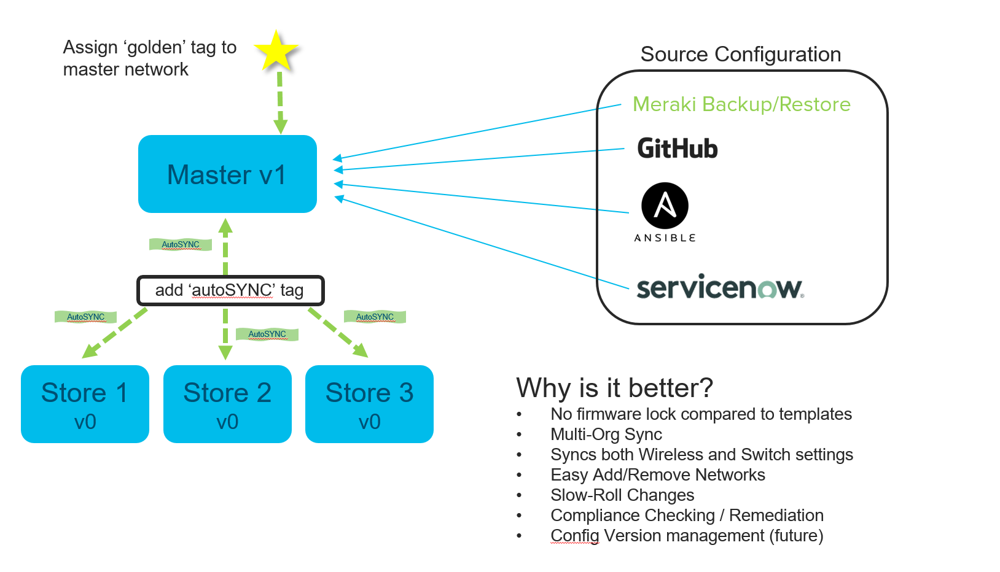
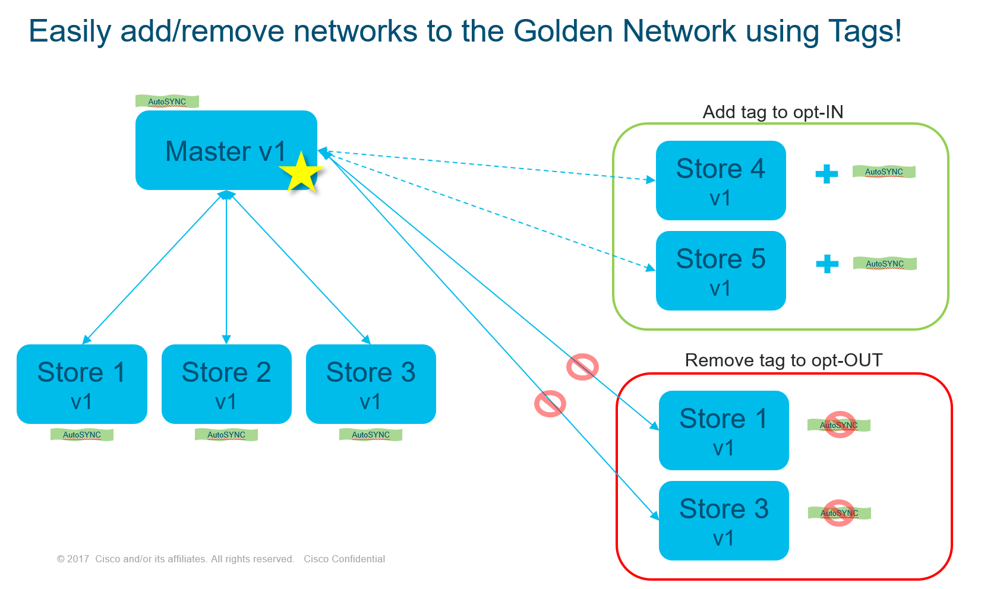
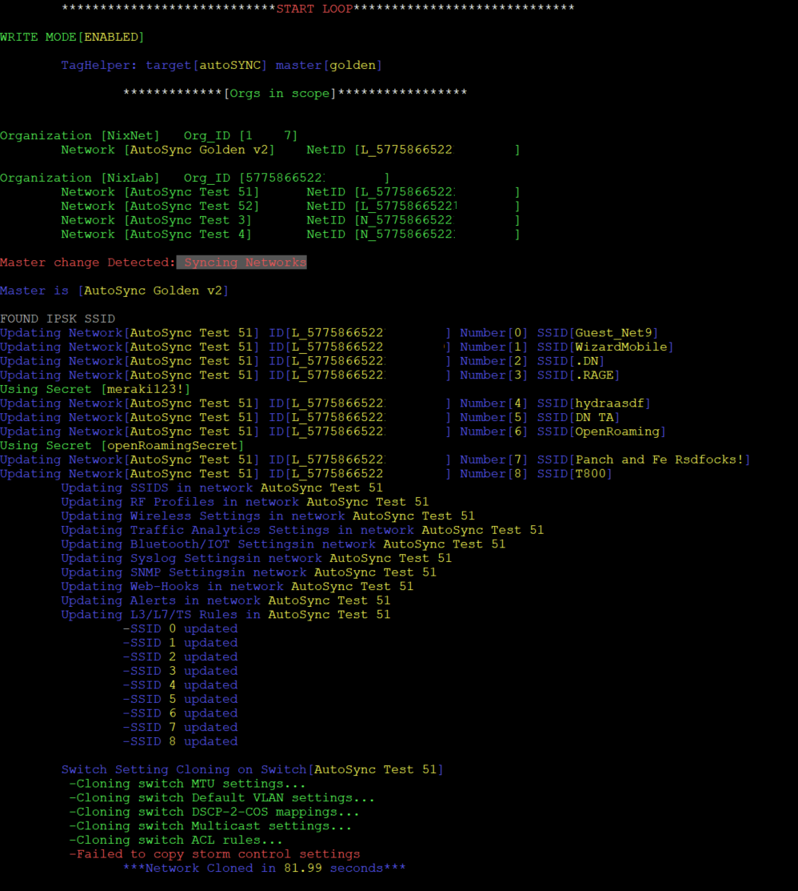

# autoSYNC
## "The Golden Network" template alternative
Synchronizes meraki network settings from a parent network (golden network) to child networks for a more flexible template alternative. The script runs in a constantly, monitoring change-logs to detect changes to child networks or the master. If any children are out of compliance, the settings are reverted to the master settings. While any changes to the master will be replicated out to all children. The tool is smart, only pushing the differential config, allowing for much greater scale and API efficiency.

## How it works
1. Edit the file 'autoSYNC.cfg.default'. Make changes to match your needs and save it to 'autoSYNC.cfg'
2. tag all your MR networks with TARGET tag (default is 'autoSYNC')
3. tag ONE network, your MASTER network with MASTER tag AND TARGET tag (default master tag is 'golden')
4. You can only have one MASTER in each network, if you have more or less than 1... it'll sleep until it's fixed. (good for migrating Master assignments)
4. run the autoSYNC.py script. it'll do the rest

## notes
1. API Key - it'll ask you to enter your API key every time unless you run **'create_keys.py'** to import your API key
2. Once you do the above, you won't have to enter your key ever again as long as it's valid. 
3. This is beta, lots of stuff broken. YMMV. Might release the magic blue smoke from your gear, may the force be with you and don't use in production!

## Requirements
1. Latest Meraki python library (1.x or later)

# what works today? **Updated[Nov 6 '20]**

###### General (working)
* **Gold** Master network changes replicate to children networks
* Changes in children networks revert to match Master network (only pushes changes, not whole profile)
* Group-Policies
* Syslog Servers
* SNMP Settings
* Network Alerts
* Webhooks

###### Wireless (working)
* iPSK w/o radius keys
* SSID Syncronization
* RF-Profiles
* Wireless Network Settings
* Traffic Analysis
* Bluetooth Settings
* Per-SSID L3 Firewall Rules
* Per-SSID L7 Firewall Rules

###### Switching (working)
* MTU settings
* Default Management Vlan
* Switch Network Settings
* DSCP-2-COS Mappings
* Spanning-Tree settings
* Multicast Settings
* Switch ACL rules
* Network Storm Control
* Switch QoS Rules
* Switch Power Management

## what's next?

###### General (in progress)

* Named Org-Whitelist(instead of org_id)
* Whitelist Validation (makes sure all orgs that are inscope are accessible via API)

###### Wireless (in progress)
* Scanning API Receivers (no API endpoint currently)

###### Switching (future)
* auto-STP mapping based on switch type (ex. MS425 priority of 4096 vs MS210 with priority of 32768)
* auto-Aggregation
* port-based TAG syncronization (syncs ports across switches)
* autoMAC integration, like API Secure-Connect (port provisioning and port-profiling) 
* Adaptive Policy assignment and sync across networks
